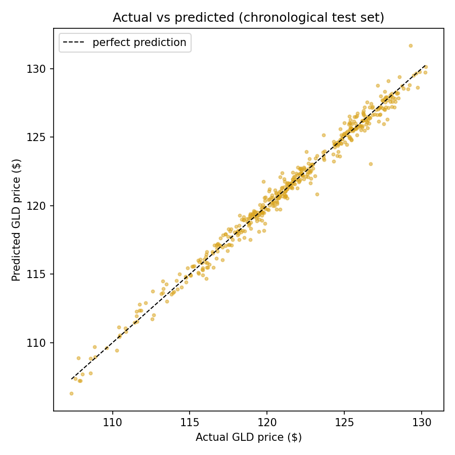
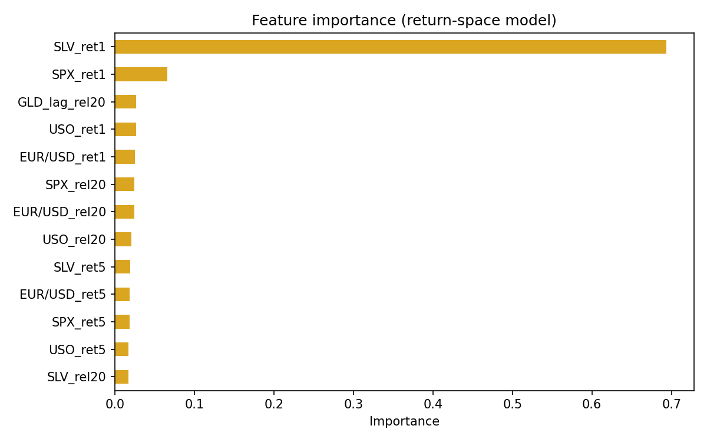

# Gold Price Predictor

Predicts the GLD gold ETF price from same-day moves in the S&P 500, oil (USO), silver (SLV) and EUR/USD, using a Random Forest trained on returns — with an honest, time-based evaluation and a live Streamlit app.

**Live demo:** _coming soon (Streamlit Community Cloud)_



## The honest accuracy story

The first version of this project reported **98.94% R²**. That number was inflated by **data leakage**: it came from a *random* train/test split on daily time series data. Random splitting scatters test days in between their own training-set neighbors, so the model just memorizes adjacent days. On top of that, Random Forests cannot extrapolate, so a model trained on raw 2008–2016 price levels is structurally unable to predict 2016–2018 prices outside its training range.

Measured properly — training on the first 80% of days (2008 → Apr 2016) and testing on the last 20% (Apr 2016 → May 2018):

| Model | Split | R² (price) | MAE |
|---|---|---|---|
| Raw price levels (original) | random | 0.99 | $1.23 |
| Raw price levels (original) | **chronological** | **−0.45** | $4.49 |
| Naive baseline (predict yesterday's close) | chronological | 0.96 | $0.73 |
| **Return-space model (this repo)** | **chronological** | **0.99** | **$0.42** |

So the original 98.94% collapses to a *negative* R² once the leakage is removed. The shipped model fixes it by predicting GLD's **same-day return** instead of its price level (returns are stationary, so the forest generalizes across price regimes), then reconstructing the price from the previous close.

Two honesty caveats on the shipped model's numbers:

- **Price-level R² is a flattering metric** for any daily model, because prices are highly persistent — even the naive "predict yesterday's close" baseline scores 0.96. The defensible claims are: **MAE of $0.42 vs $0.73 for the naive baseline** (a 42% improvement), and a same-day **return R² of 0.66**.
- This is a **nowcast, not a forecast**: given *today's* market values, it estimates where gold *should be trading* today. Predicting *tomorrow's* return from today's data barely beats the naive baseline — daily gold returns are close to unpredictable, and pretending otherwise would be the same dishonesty as the leaky split.

A nice side effect of return space: GLD now trades around **$377**, double the maximum ($185) in the 2008–2018 training data — and the model still produces sensible live predictions, because it predicts moves, not levels.

## Why time-based splitting matters here

For time series, evaluation must simulate reality: **train on the past, predict the future**. A random split answers "can the model interpolate between days it has already seen?" (easy, useless), while a chronological split answers "can the model handle days from a future it has never seen?" (the actual job). Any financial ML result presented without a time-based split — or a comparison against the naive persistence baseline — should be treated as suspect. This project learned that the hard way, on purpose.

## What drives the predictions



The same-day **silver move (`SLV_ret1`) dominates with ~70% importance**, which matches financial intuition: gold and silver are driven by the same macro forces (real rates, USD strength, risk sentiment) and co-move tightly within a day. The S&P 500 move is a distant second; oil and EUR/USD contribute little at daily horizon. Note the raw-level correlation analysis says the same thing (SLV–GLD correlation of 0.87; everything else near zero), so the model's behavior is consistent with the data.

## The app

Streamlit app with two modes:

- **Live** — pulls the latest SPX / USO / SLV / EUR-USD closes from Yahoo Finance (via `yfinance`), predicts today's gold price, and plots it against the recent GLD trend, with an uncertainty band from the spread of the forest's trees.
- **Manual** — enter your own market values and watch the prediction update, with a sensitivity chart showing which inputs are pulling the prediction up or down.

> ⚠️ Educational / portfolio project. **Not financial advice.**

## How to run

```bash
pip install -r requirements.txt

# Train the model and generate results/ charts + metrics
python -m src.train

# Run the tests
python -m pytest tests/

# Launch the app
streamlit run app/app.py
```

## Project structure

```
src/
  data_loader.py   # load & clean the historical CSV, time-based split
  features.py      # return/lag/rolling feature engineering
  model.py         # RandomForest wrapper: train/predict/save/load/importance
  train.py         # CLI: python -m src.train
  live_data.py     # latest market data via yfinance
app/app.py         # Streamlit app (Live + Manual modes)
tests/             # feature & model tests
notebooks/         # exploration notebook (imports from src/)
data/              # 2008-2018 daily prices (GLD, SPX, USO, SLV, EUR/USD)
models/model.pkl   # trained model
results/           # metrics.json + charts
```

## What I'd improve with more time

- **Macro features** — real interest rates (TIPS yields), the DXY dollar index, and VIX are the textbook gold drivers; daily ETF prices alone are a thin view of the world.
- **Prediction intervals, properly** — the current band is per-tree spread (model disagreement), not a calibrated interval. Conformal prediction or quantile regression forests would give honest coverage guarantees.
- **Gradient boosting comparison** — XGBoost/LightGBM on the same features, with walk-forward cross-validation rather than a single chronological split.
- **True forecasting** — extend from nowcasting to a t+1/t+5 horizon and be upfront that the edge over naive persistence will be small.
- **Retraining pipeline** — the model is trained on 2008–2018 data; a scheduled job pulling fresh history from yfinance and retraining would keep it current.
